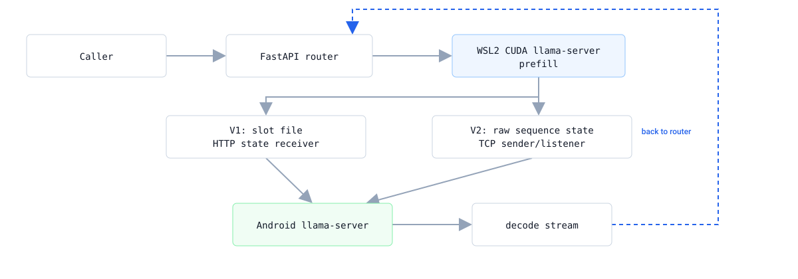
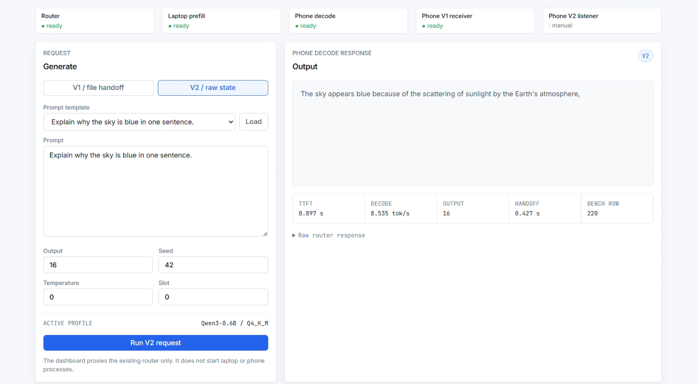
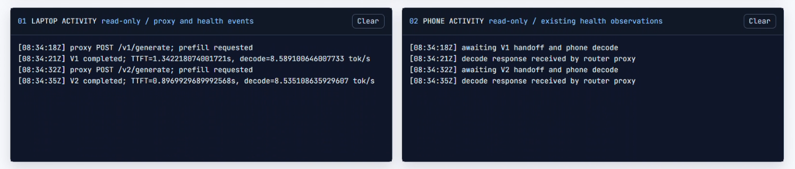

# EdgeSplit

> Split LLM inference across two machines: prefill on a laptop GPU, decode on an Android phone.


[](LICENSE)

LLMs generate text in two phases with very different hardware needs. **Prefill**
(processing your prompt) is parallel and compute-bound. **Decode** (generating
tokens one at a time) is sequential and memory-bandwidth-bound. Running both on
one device means the phase that needs a GPU and the phase that doesn't are stuck
sharing it.

EdgeSplit runs each phase where it fits: prefill on a CUDA laptop, then it hands
the live sequence state over Wi-Fi to an **Android phone** (Cortex-A57 / A53,
3 GB LPDDR4), which finishes decoding. The laptop GPU is free the moment
prefill ends.

The measured result: V2's raw-TCP handoff cuts time-to-first-token from
**2.425s to 0.841s** on Qwen3-0.6B Q4_K_M, and up to **82%** across three
quantizations, while decode stays flat because both modes decode on the same
phone. A hand-tuned NEON accumulator change in llama.cpp's Q4_K×Q8_K dot product
adds **4.8%** decode throughput on that phone over a stock build.



- **Two working handoff paths.** V1 uses stock llama.cpp endpoints and a state
  file over HTTP. V2 adds two patched llama-server endpoints and streams the raw
  sequence state over a checksummed TCP frame, creating no file at all.
- **V2 cuts time-to-first-token 65-82%** on Qwen3-0.6B across three
  quantizations, from five retained paired runs each.
- **Built for offload, not throughput.** The trade is explicit: the phone decodes
  at 2.2-9.3 tok/s against the laptop's 122-241 tok/s, and the GPU is free from
  the moment prefill ends.

**[Demo](#demo)** · **[Architecture](docs/ARCHITECTURE.md)** · **[Benchmarks & method](docs/BENCHMARKS.md)** · **[Device notes](docs/DEVICE-NOTES.md)**

## Demo

### 1. Video walkthrough

<!-- Drag EdgeSplit_demo_subtitled.mp4 onto this line in the GitHub editor.
     GitHub uploads it and replaces this comment with an inline player. -->

### 2. Control dashboard, one completed V2 request



**What this shows.** All four services live, top row. The response text was
generated on the phone from a sequence prefilled on the laptop GPU.

**Measured and logged.** 0.897 s to first token, 8.535 tok/s decode, a 0.427 s
raw state handoff, written to benchmark row 220. Output is capped at 16 tokens,
matching the Qwen protocol in [Results](#results).

### 3. Both devices, one V1 request then one V2 request



**What this shows.** Read-only event mirrors from each machine, side by side.
This is the clearest evidence that two devices are actually involved.

**Same prompt, both modes.** TTFT drops from 1.342 s to 0.897 s. Decode stays
flat at 8.589 and 8.535 tok/s, because both modes decode on the same phone.

**One live request, not the benchmark.** This is a single interactive pair from
the demo session. The five-pair statistics, with warm-up exclusion and per-run
row IDs, are in [Results](#results).

## How it works

A request crosses two machines in one pass:

1. The router renders the chat template **once**, on the laptop, via
   llama-server's `/apply-template`. Prefill and continuation must receive
   byte-identical text or the phone restores a sequence that doesn't match what
   it's about to continue.
2. The laptop CUDA llama-server prefills into a slot with `n_predict = 0`.
3. The slot's sequence state crosses to the phone by one of two paths.
4. The phone continues generation from the restored sequence and streams tokens
   back.

**V1: file handoff.** `POST /slots/:id?action=save` → HTTP upload of the ~1.26 MB
state file → `POST /slots/:id?action=restore`. Stock endpoints only. This proved
the pipeline worked before anything was optimized.

**V2: raw sequence handoff.** Two added endpoints:

```text
GET  /edgesplit/v2/state/:id_slot   ->  raw sequence envelope
POST /edgesplit/v2/state/:id_slot   <-  restored in process
```

The constraint that shaped the patch: `llama_state_seq_get_data_ext()` and
`llama_state_seq_set_data_ext()` aren't safe to call from an arbitrary thread
while the server is running. Instead of reaching into llama-server's internals
from the HTTP handler, the patch adds two task types that **enqueue on
llama-server's existing task queue**, so both calls run on the thread that
already owns the slot. That's why V2 could be added without touching the stock
`/slots` routes, and why both modes work from one binary.

Python wraps the resulting envelope in a network-byte-order frame with a tensor
descriptor, model ID, llama.cpp commit, and a SHA-256 over the whole thing, then
never looks inside the payload. The KV layout is private to llama.cpp and
version-specific; reimplementing it in Python would be a silent-corruption bug
waiting for the next upstream change.

Full frame format and rationale: **[docs/ARCHITECTURE.md](docs/ARCHITECTURE.md)**.

## Results

Qwen3-0.6B, 11 prompt tokens, 16 generated. One warm-up pair excluded, five
retained pairs per mode. **Mean ± sample standard deviation (median)**.

This is the **GPU-instrumented pass**, with `nvidia-smi` sampled every 100 ms
across each request. An earlier **timing-only pass** ran the same method without
power sampling and reported 76.16% / 74.78% / 72.11%. Both are retained as
separate evidence; neither replaces the other.

| Quant | V1 TTFT | V2 TTFT | Change |
| --- | ---: | ---: | ---: |
| Q4_K_M | 2.425 ± 1.262 s (2.022) | 0.841 ± 0.272 s (0.793) | **-65.32%** |
| Q4_0 | 3.569 ± 0.326 s (3.406) | 0.632 ± 0.043 s (0.650) | **-82.30%** |
| Q8_0 | 3.404 ± 0.490 s (3.681) | 0.610 ± 0.084 s (0.594) | **-82.09%** |

The mechanism is deliberately simple: V1 writes a 1.26 MB file, uploads it, and
reads it back; V2 streams the same bytes over one socket. The result worth
pointing at is the handoff itself, live sequence state moving between x86_64 and
aarch64 with generation resuming from it on the other side.

Repeated on Llama-3.2-1B-Instruct as a second model family, where the gap
narrows to 1.67-23.56% because phone decode dominates a 64-token request.
Laptop GPU board power was sampled every 100 ms across every retained run.

Full tables, both model families, laptop-only baselines, per-run row IDs, and the
power-stability rerun: **[docs/BENCHMARKS.md](docs/BENCHMARKS.md)**.

## Design decisions

| Choice | What was picked | Why this over the alternative |
|---|---|---|
| State handoff | Raw TCP frame, patched endpoints | llama.cpp's RPC backend shards layers to pool memory, a different problem, and adds a round trip per layer. That is pure overhead once the model fits on one device. |
| Patch integration | Enqueue on llama-server's task queue | `llama_state_seq_*_ext()` isn't safe from an arbitrary thread. Enqueuing runs it on the thread that owns the slot, so the patch stays additive and the stock `/slots` routes are untouched. |
| Payload handling | Treat the state envelope as opaque | The KV layout is private to llama.cpp and version-specific. Reimplementing it in Python would silently corrupt on the next upstream change. |
| Wire format | Custom framing with SHA-256 | Sender is x86_64, receiver is aarch64. Network byte order plus an explicit tensor descriptor and digest makes a cross-architecture handoff debuggable instead of a bare `send()`. |
| Commit parity | Hash carried in frame metadata | Mismatched builds don't fail cleanly, they corrupt or hang. The receiver refuses a frame whose commit differs from its own. |
| Chat template | Rendered once, on the laptop | Prefill and continuation must get byte-identical text. Rendering via the model's own `/apply-template` avoids duplicating Qwen and Llama syntax in Python where it would drift. |
| Phone-side deps | Standard library only | The same benchmark and transfer files run unchanged under Termux, with no pip install on a 3 GB device. |
| Benchmark storage | SQLite, append-only | Warm-ups are marked invalid rather than deleted, and an attempt row is written before inference, so a killed Android process stays visible as unfinished. |
| Power metrics | Two sources, kept separate | GPU board power and whole-device battery power measure different things. Summing them would produce a number with no physical meaning. |
| Concurrency | One request at a time | A llama.cpp slot isn't a concurrent resource, so each orchestrator holds a lock for the whole request rather than pretending otherwise. |

## Scope

What the project covers, and where its edges are.

- **V2 changes the handoff, decode is untouched.** Both modes decode on the same
  phone with the same runtime, so the measured deltas of -10.7% to +0.5% across
  six model/quant cells are the phone's own variation. Qwen Q8_0 at -10.7% is
  wider than its sample spread accounts for and remains unexplained.
- **The trade is throughput for a free GPU.** The phone decodes 20x to 63x slower
  than the laptop, depending on model and quant. That is the cost of moving
  decode off the GPU, and it is the intended trade rather than a side effect.
- **Laptop GPU power is instrumented; phone power is deliberately excluded.** Two
  battery samplers were built and both proved untrustworthy, so the metric was
  dropped rather than published.
  [Why](docs/BENCHMARKS.md#phone-battery-power-measured-then-excluded).
- **V2 eliminates the disk write, the network upload, and the disk read.** Two
  in-memory copies remain in the Python listener; removing them means moving the
  listener into the C++ server.
- **Single-request by design.** A llama.cpp slot is not a concurrent resource, so
  each orchestrator holds a lock for the whole request.
- **Validated on one laptop and phone pair**, across two model families and three
  quantizations, five retained pairs per cell.

## Quickstart

| To run | You need |
|---|---|
| The test suites | Python 3.11+, any OS. No GPU and no phone. |
| The laptop half | Linux or WSL2 with an NVIDIA GPU, the CUDA toolkit, `cmake`, and a C++ compiler. `nvidia-smi` must work inside WSL2. The build and run scripts are bash. |
| The full two-device demo | The above, plus a rooted Android phone on the same LAN running a source build of the pinned llama.cpp revision. |

Developed and measured on WSL2 (Ubuntu 24.04) with an RTX 4050 Laptop GPU, 6 GB.

```bash
git clone <your-repo-url> ~/edgesplit
cd ~/edgesplit
python -m venv .venv && . .venv/bin/activate
pip install -r requirements.txt
```

On WSL2, clone into the WSL filesystem as shown, not a `/mnt/c` Windows path.
V1's handoff writes a 1.26 MB state file to disk on every request, and DrvFs
overhead across the `/mnt/c` boundary inflates that enough to distort the V1
timings and make the V1-versus-V2 comparison meaningless.

**Without a phone**, run the laptop-side suites: the V1/V2 orchestration against
a fake transport, the binary frame round trip and its corruption rejection, the
benchmark statistics, and the dashboard:

```bash
for suite in kv_transfer router bench dashboard; do
  ( cd "$suite" && python -m unittest discover -p 'test_*.py' -v )
done
```

On Windows the `bench` and `router` suites report `PermissionError` while
removing their temporary directories, because SQLite connections are still open.
The assertions pass; only cleanup fails. On Linux and macOS all four are clean.

**For the full two-device demo**, both machines must run the same pinned
llama.cpp revision. Build each side:

```bash
./prefill/build_laptop_wsl.sh              # laptop: pin llama.cpp, apply V2 patch
TERMUX_ANDROID_API=28 ./decode/setup_termux.sh   # phone, in Termux
```

The phone then runs three services in separate Termux sessions: the patched
llama-server (8081), the V1 receiver (8090), and the V2 TCP listener (8091).
Exact commands and model paths: **[demo/README.md](demo/README.md)**.

With those up, start the laptop server and router:

```bash
EDGESPLIT_PHONE_HOST=<phone-lan-ip> ./demo/start_laptop_demo.sh
```

That stays in the foreground on port 8083. From a second terminal:

```bash
curl -fsS -X POST http://127.0.0.1:8083/v2/generate \
  -H 'Content-Type: application/json' \
  -d '{"prompt":"Explain why the sky is blue in one sentence.","n_predict":16,"seed":42}'
```

Swap `/v2/` for `/v1/` to use the file handoff. Both return the completion plus
TTFT, decode rate, handoff size, and the benchmark row ID.

## Configuration

All settings are environment variables with defaults. The phone addresses have no
usable default and must be set.

| Variable | Default | Purpose |
| --- | --- | --- |
| `EDGESPLIT_LAPTOP_URL` | `http://127.0.0.1:8080` | Laptop llama-server |
| `EDGESPLIT_PHONE_URL` | *(none)* | Phone llama-server, V1 |
| `EDGESPLIT_PHONE_UPLOAD_URL` | *(none)* | Phone V1 state receiver |
| `EDGESPLIT_V2_PHONE_URL` | *(none)* | Phone llama-server, V2 |
| `EDGESPLIT_V2_PHONE_HOST` / `_PORT` | *(none)* / `8091` | Phone V2 TCP listener |
| `EDGESPLIT_BENCH_DB` | `bench/edgesplit.sqlite3` | SQLite benchmark database |
| `EDGESPLIT_MODEL_NAME` / `_QUANT` | `Qwen3-0.6B` / `Q4_K_M` | Labels recorded on each row |
| `EDGESPLIT_HTTP_TIMEOUT_SECONDS` | `120` | Per-request timeout |

## Repository map

```text
router/         FastAPI control plane; additive /v1 and /v2 modes
kv_transfer/    binary transfer frame, laptop sender, phone listener
patches/        llama.cpp patches: V2 endpoints, NEON accumulator
prefill/        CUDA build and laptop server scripts
decode/         Termux build, V1 receiver, V2 listener, power sampler
bench/          SQLite harness, baselines, paired-repetition runners
dashboard/      loopback-only demo UI and its backend
results/        result notes and machine-readable run artifacts
docs/           architecture, benchmarks, device notes
```

## Investigation notes

Four findings that were not obvious going in.

- **Built two power samplers, then trusted neither.** The vendor sysfs source
  returned readings up to 251 A on a phone battery. A second sampler was
  mechanically sound but showed consecutive idle windows disagreeing by 200 mW
  with 2.4 W internal ranges. No number was reported.
  [Detail](docs/BENCHMARKS.md#phone-battery-power-measured-then-excluded)
- **Found the one kernel path this CPU can actually run.** Cortex-A57/A53 are
  ARMv8.0-A and `SDOT` arrived in ARMv8.2-A, so backend scoring confirmed only
  the `armv8.0_1` variant is eligible. Tightening that baseline kernel was
  therefore the lever worth pulling.
  [Detail](docs/DEVICE-NOTES.md#why-the-dot-product-path-was-never-available)
- **Verified the optimization before believing it.** Distinct artifact hashes,
  `/proc/<pid>/maps` confirming which library each process actually loaded, and a
  fixed-seed gate proving byte-identical output. Two of three profiling
  approaches failed before PID-attach worked.
  [Detail](docs/DEVICE-NOTES.md#verifying-the-neon-change-actually-took-effect)
- **Isolated a device-specific failure instead of hiding it.** A second phone's
  source build crashed on model load. Running the identical revision on the
  Cortex-A57 phone proved it was ROM-specific rather than an EdgeSplit bug,
  which is why the two phones have different roles.
  [Detail](docs/DEVICE-NOTES.md#the-preserved-v1-phones-from-source-build-failure)

## How this was built

EdgeSplit was built for the **OpenAI Build Week hackathon**, using Codex as the
main development tool.

The work covered reading llama.cpp's state-handling path, patching
`llama-server` with two additive endpoints, designing the V2 transfer protocol,
building the router and benchmark harness, and running the paired measurements
across both devices.

The hackathon window is why this is a single-request prototype on one device pair
rather than a broader study.

## License and credits

[MIT](LICENSE). Built on [llama.cpp](https://github.com/ggml-org/llama.cpp) (MIT).
The files in `patches/` are diffs against a pinned upstream revision and remain
subject to its license. llama.cpp itself is fetched by the build scripts, not
vendored here.
